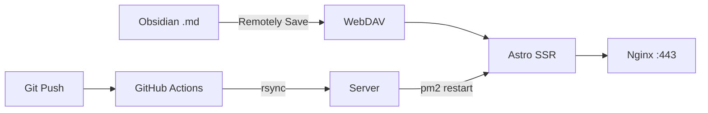

<p align="center">
  
</p>

<h1 align="center">prom1se.cn</h1>
<p align="center">
  
  
  
  
  
  
  
</p>

<p align="center">
  <a href="https://prom1se.cn"><strong>prom1se.cn</strong></a> ·
  <a href="https://github.com/Prom1seCN/BHTX-baihuatongxing">百花同行</a>
</p>

<p align="center">
  
  
  
</p>

---

## ✨ 特性

- **全自动博客** — Obsidian 写完，点 Sync，秒上线。手机也行。
- **站内搜索** — SSR 实时搜博客 + 项目，当前页跳转。
- **GitHub Actions CI/CD** — `git push` 自动构建 → rsync → pm2 重启。
- **深色/浅色切换** — CSS 变量驱动，localStorage 记忆。
- **多引擎搜索框** — 必应/Google/百度/B站/知乎/GitHub/YouTube/Prom1seCN 站内。
- **数学公式渲染** — KaTeX，`$W = F \cdot s$`。
- **鼠标荧光** — 橙色 radial-gradient 跟随光标。

## 🛠 技术栈



| 层 | 选择 |
|----|------|
| 框架 | **Astro 5** (Static + SSR 混合) |
| 交互 | React 19 |
| 样式 | Tailwind CSS 3 + 自定义 CSS 变量 |
| Markdown | marked + gray-matter (自定义解析器) |
| 数学 | KaTeX CDN |
| 字体 | SimHei / PingFang SC |
| 部署 | pm2 + Nginx 反向代理 |
| SSL | acme.sh + Let's Encrypt (60d 自动续期) |
| CI/CD | GitHub Actions |

## 📂 结构

```
src/
├── pages/
│   ├── index.astro          # 首页
│   ├── projects.astro       # 项目
│   ├── blog.astro           # 博客列表 (SSR)
│   ├── blog/[slug].astro    # 文章详情 (SSR)
│   ├── search.astro         # 站内搜索 (SSR)
│   ├── about.astro          # 关于
│   ├── 404.astro            # 404
│   └── en/                  # English
├── components/              # React
│   ├── SearchBox.tsx        # 多引擎搜索
│   ├── ThemeToggle.tsx      # 主题切换
│   ├── SocialIcons.tsx      # 社交链接
│   ├── CursorGlow.tsx       # 光标发光
│   └── ScrollReveal.ts      # 滚动渐入
├── layouts/
│   └── BaseLayout.astro
└── styles/
    └── global.css
```

## 🚀 本地开发

```bash
git clone https://github.com/Prom1seCN/prom1secn-website.git
cd prom1secn-website
npm install --legacy-peer-deps
npm run dev
```

浏览器 `http://localhost:4321`。博客页面自动读取本地 Obsidian 仓库（`D:\note\PROM1SE` 或环境变量 `NOTES_DIR`）。

## 📝 发文章

```
Obsidian 写 → 属性栏加 publish: true → 点 Sync → 网站自动上线
```

| 属性 | 必填 | 说明 |
|------|:---:|------|
| `title` | ✅ | 文章标题 |
| `date` | ✅ | YYYY-MM-DD |
| `publish` | ✅ | `true` = 上线 |

## 📄 License

MIT — 随便用，Star 就行。
